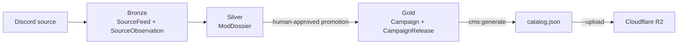

# Data architecture

## Medallion flow

The pipeline separates observed facts from editorial interpretation and from
the public app contract. A later layer may reference an earlier layer, but it
must not overwrite it.

## Bronze: source evidence

| Model | Purpose | Important fields |
| --- | --- | --- |
| `SourceFeed` | A stable external source location, such as a Discord forum thread or dedicated update channel. | `sourceKey`, URL, guild/channel IDs, `kind`, `cadence`, check timestamps |
| `SourceObservation` | An immutable capture of a single source message. | message ID and URL, raw text, author, timestamps, fingerprint, reactions |

`sourceKey` normally has the form `discord:<guild-id>:<channel-or-thread-id>`.
It is the external identity; channel titles are descriptive only. An observation
key includes a content fingerprint, so a later capture does not erase prior
evidence.

## Silver: reviewable mod dossier

`ModDossier` is the working record for both proposed and existing mods.

| Concern | Silver fields |
| --- | --- |
| Identity | `dossierKey`, title, author, branch, proposed campaign ID |
| Evidence | primary/update feeds, origin/latest observations, `sourceContext`, `sourceEvidence`, notes |
| Current state | author status, CCM compatibility, version, download URL, popularity snapshot |
| Editorial | short description, editorial body, tags, difficulty, choose/avoid guidance |
| Process | review status, last/next check timestamps |

`primarySourceFeed` is the source used for the project description.
`officialUpdateFeed` is a distinct official channel when versions or patch notes
are maintained elsewhere. `sourceContext` materializes the explicitly selected
Bronze messages that a reviewer needs to read; reviewer commentary belongs in
`sourceNotes` instead.

### Review states

| State | Meaning |
| --- | --- |
| `DRAFT` | A candidate or incomplete dossier. |
| `IN_REVIEW` | A source-backed editorial proposal is ready for a person. |
| `CHANGES_REQUESTED` | The reviewer identified missing or incorrect work. |
| `APPROVED` | Silver content is accepted; it is still not public until Gold is updated and published. |
| `REJECTED` | The mod is not eligible for publication. Evidence remains available for traceability. |

### Refresh policy

`SourceFeed.cadence` expresses the desired inspection frequency. Use `WEEKLY`
for active work, `QUARTERLY` for complete but living projects, and `MANUAL` for
exceptional or archived sources. A scheduler is not implemented in this
repository; an operator or agent selects overdue sources using `nextCheckAt`,
captures new Bronze messages, and then refreshes the affected Silver dossier.

## Gold: published catalog contract

| Model | Purpose |
| --- | --- |
| `Campaign` | Published public campaign card. `campaignId` and `catalogOrder` are stable identifiers. |
| `CampaignRelease` | A validated package release: version, HTTPS URL, SHA-256, and byte size. |

`ModDossier.goldCampaign` links reviewable content to its public campaign. It
is a traceability relation, not an automatic field copy.

The generator reads only `Campaign(stage: PUBLISHED)` and maps these fields:

| Gold field | `catalog.json` field |
| --- | --- |
| `campaignId` | `id` |
| `title`, `author`, `shortDescription`, `tags` | Campaign card |
| `branch` | `requirements.campaign` |
| `currentRelease` | Version and package URL/SHA-256/size |

The generator rejects invalid catalog shape, unapproved removals, and unsafe
package metadata changes before an upload can occur.
